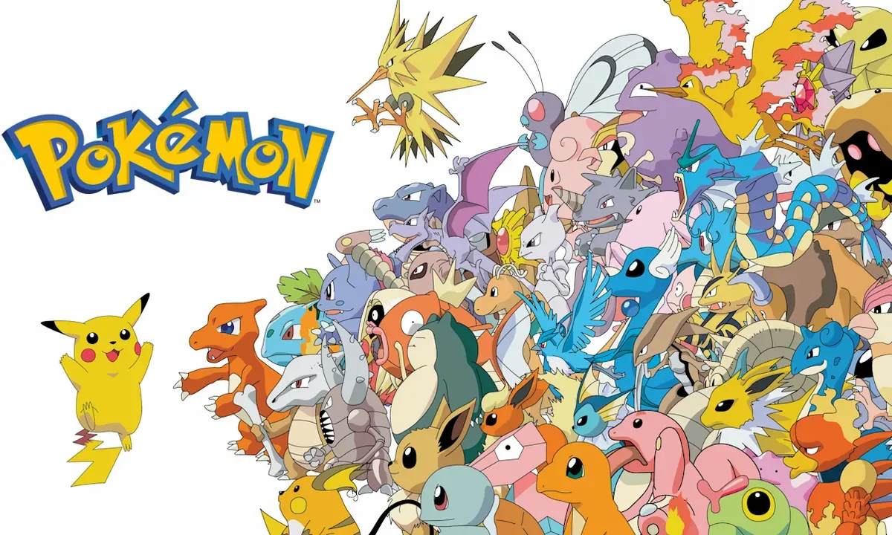

# **Gotta Analyse 'Em All: Exploring Pokémon Types and Type Combinations**

Pokémon, the highest-grossing media franchise in the world, began in 1996 as a video game for the Game Boy. Since then, it has grown into a global phenomenon, including games, trading cards, movies, TV shows, and merchandise. At the heart of Pokémon is a world inhabited by unique creatures. Each Pokémon has distinct abilities and types, which determine its strengths and weaknesses in battle. These types, such as Fire, Water, and Electric, play a central role in the game’s strategy.

This notebook explores two key questions:
- What are the most common Pokémon types and type combinations?
- How do different types affect battle performance?
  
The analysis uses data from The Complete Pokémon Dataset by Rounak Banik, which includes information on Pokémon from the first seven generations. This study highlights the thoughtful design and strategic complexity that have made Pokémon a global success for decades.
